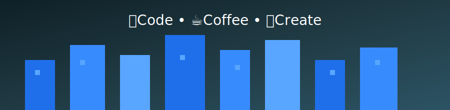

<p align="center">

</p>

<h1 align="center">Hi 👋 I'm Lakshita Gupta</h1>

<p align="center">

</p>


# 🌍 Visitors

<p align="center">


</p>

 

<h2 align="center">⚡ Tech Stack</h2>

<p align="center">


</p>

<p align="center">


</p>

<p align="center">


</p>


<p align="center">


</p>


 


# 🚀 Featured Projects

| Project | Description |
|-------|-------------|
| DevPulse | Full stack project management |
| Port.2109 | Personal dev portfolio |
| Cold Email Optimizer | AI outreach optimization |
| HireSense AI | ATS Resume Analyser |


 


# 🧠 AI Project Assistant

I built an **AI assistant that answers questions about my projects, tech stack, and GitHub work.**

You can ask things like:

- Explain DevPulse project
- What technologies does Lakshita use
- Show AI projects

Try it here:

https://dev-portfolio-mocha-beta.vercel.app/

 

<!--# 📊 GitHub Stats

 ===================== STATS OVERVIEW ===================== 


<p align="left">


</p>

<p align="right">


</p>


<!-- ========================================================== 

 

-->

<h2 align="center">⏱ Weekly Coding Activity</h2>

<!--START_SECTION:waka-->


**🐱 My GitHub Data** 

> 📦 175.6 kB Used in GitHub's Storage 
 > 
> 🏆 148 Contributions in the Year 2026
 > 
> 💼 Opted to Hire
 > 
> 📜 19 Public Repositories 
 > 
> 🔑 0 Private Repositories 
 > 
**I'm a Night 🦉** 

```text
🌞 Morning                3 commits           ░░░░░░░░░░░░░░░░░░░░░░░░░   01.28 % 
🌆 Daytime                77 commits          ████████░░░░░░░░░░░░░░░░░   32.91 % 
🌃 Evening                140 commits         ███████████████░░░░░░░░░░   59.83 % 
🌙 Night                  14 commits          █░░░░░░░░░░░░░░░░░░░░░░░░   05.98 % 
```
📅 **I'm Most Productive on Friday** 

```text
Monday                   24 commits          ███░░░░░░░░░░░░░░░░░░░░░░   10.26 % 
Tuesday                  43 commits          █████░░░░░░░░░░░░░░░░░░░░   18.38 % 
Wednesday                52 commits          ██████░░░░░░░░░░░░░░░░░░░   22.22 % 
Thursday                 22 commits          ██░░░░░░░░░░░░░░░░░░░░░░░   09.40 % 
Friday                   54 commits          ██████░░░░░░░░░░░░░░░░░░░   23.08 % 
Saturday                 19 commits          ██░░░░░░░░░░░░░░░░░░░░░░░   08.12 % 
Sunday                   20 commits          ██░░░░░░░░░░░░░░░░░░░░░░░   08.55 % 
```


📊 **This Week I Spent My Time On** 

```text
🕑︎ Time Zone: Asia/Kolkata

💬 Programming Languages: 
Markdown                 4 mins              █████████████████████████   100.00 % 

🔥 Editors: 
VS Code                  4 mins              █████████████████████████   100.00 % 

🐱‍💻 Projects: 
app_hiresense_AI_26_03_054 mins              █████████████████████████   100.00 % 

💻 Operating System: 
Windows                  4 mins              █████████████████████████   100.00 % 
```

**I Mostly Code in JavaScript** 

```text
JavaScript               8 repos             ████████████░░░░░░░░░░░░░   47.06 % 
Python                   6 repos             █████████░░░░░░░░░░░░░░░░   35.29 % 
CSS                      1 repo              █░░░░░░░░░░░░░░░░░░░░░░░░   05.88 % 
HTML                     1 repo              █░░░░░░░░░░░░░░░░░░░░░░░░   05.88 % 
TypeScript               1 repo              █░░░░░░░░░░░░░░░░░░░░░░░░   05.88 % 
```


**Timeline**


 Last Updated on 07/03/2026 00:55:53 UTC
<!--END_SECTION:waka-->


# 🐍 Contribution Snake

<p align="center">

</p>

 


# 🌐 Connect With Me

<p align="center">

<a href="https://linkedin.com/in/YOUR-LINKEDIN">

</a>

<a href="mailto:YOURMAIL@gmail.com">

</a>

<a href="https://github.com/lakshita-01">

</a>

<a href="https://dev-portfolio-mocha-beta.vercel.app/">

</a>


</p>

 
<p><a href="YOUR_RESUME_LINK">


</a>
</p>

 


<p>
  <summary>
     &ensp;
    <b>Stats Overview</b>

  
  </summary>

   

  <div align="center">
    <span>
      <a href="https://dev-portfolio-mocha-beta.vercel.app/">
        
      </a>
    </span>
    <span>
      <a href="https://dev-portfolio-mocha-beta.vercel.app/">
        
      </a>
    </span>
    <span>
      <a href="https://dev-portfolio-mocha-beta.vercel.app/">
        
      </a>
    </span>
    <span>
      <a href="https://dev-portfolio-mocha-beta.vercel.app/">
        
      </a>
    </span>
  </div>
</p>


<br/>

⭐ If you like my projects, consider starring them!
